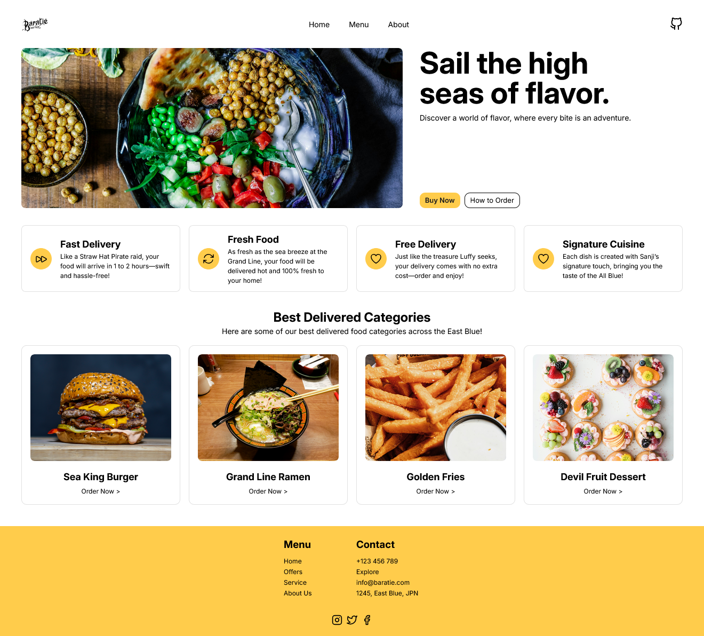

<h1 align="center">
  Baratie
  <br>
</h1>

<h4 align="center">A web application inspired by the legendary Baratie restaurant from One Piece.</h4>

<div align="center">

  
  
  
  
</div>



## 🌟 Show Your Support

Your star on GitHub can help others discover Baratie.  If you enjoy using it, consider leaving a star on this GitHub repo. 

Your support means a lot! 🌟

## How To Use

To clone and run this application, you'll need [Git](https://git-scm.com) and [npm](http://npmjs.com) installed. Follow these steps:

```bash
# Clone this repository  
$ git clone https://github.com/arvincodes/baratie.git  

# Navigate into the project directory  
$ cd baratie  

# Install project dependencies  
$ npm install  

# Install Webpack and related development dependencies  
$ npm install --save-dev webpack webpack-cli html-webpack-plugin style-loader css-loader html-loader webpack-dev-server  

# Start the development server  
$ npx webpack serve  
```
